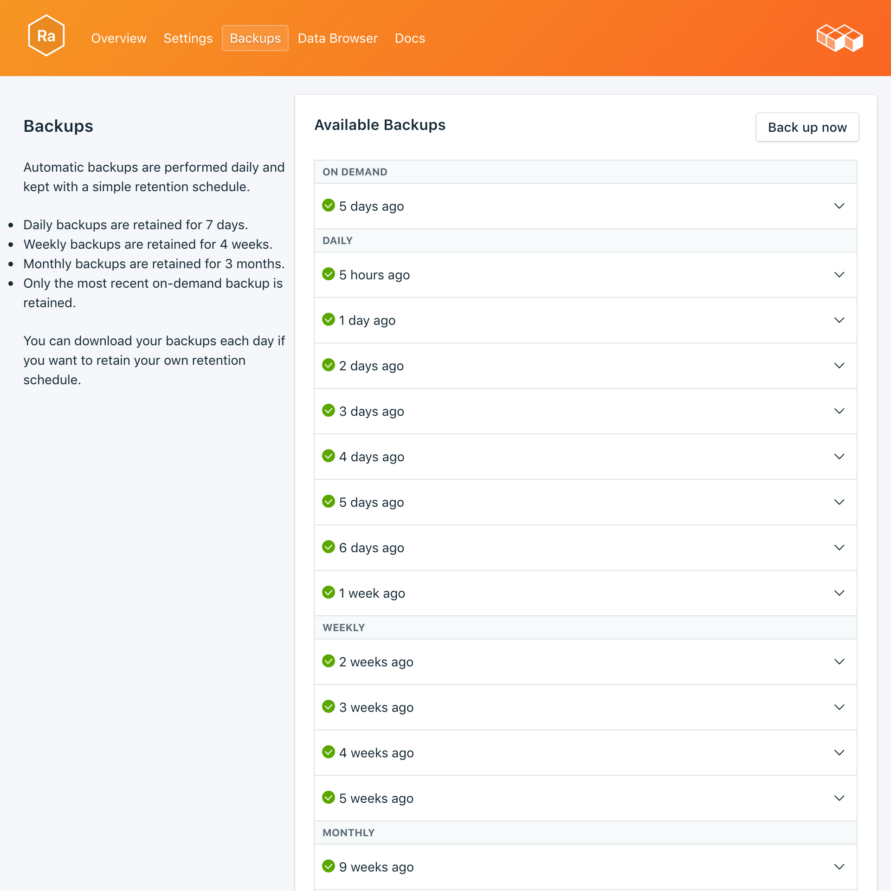

---

copyright:
  years: 2017,2018
lastupdated: "2018-03-02"
---

{:new_window: target="_blank"}
{:shortdesc: .shortdesc}
{:screen: .screen}
{:codeblock: .codeblock}
{:pre: .pre}

# Backups
{: #backups}

You can create and download backups from the _Backups_ tab of the _Manage_ page of your service dashboard. Daily, weekly, monthly, and on-demand backups are available. They are retained according to the following schedule:

Backup type|Retention schedule
----------|-----------
Daily|Daily backups are retained for 7 days
Weekly|Weekly backups are retained for 4 weeks
Monthly|Monthly backups are retained for 3 months
On-demand|One on-demand backup is retained. The retained backup is always the most recent on-demand backup.
{: caption="Table 1. Backup retention schedule" caption-side="top"}

Backup schedules and retention policies are fixed. If you need to keep more backups than the retention schedule allows, you should download backups and retain archives according to your business requirements.

## Viewing existing backups

Daily backups of your database are automatically scheduled. To view your existing backups, navigate to the *Manage* page of your service dashboard. 

  

Click on the corresponding row to expand the options for any available backup.

   

### Using the API to view existing backups

A list of backups is available at the `GET /2016-07/deployments/:id/backups` endpoint. The Foundation Endpoint with the service instance id and the deployment id are both shown in the service's _Overview_. For example: 
``` 
https://composebroker-dashboard-public.mybluemix.net/api/2016-07/instances/$INSTANCE_ID/deployments/$DEPLOYMENT_ID/backups
```  

## Creating a backup on demand

As well as scheduled backups you can create a backup manually. To create a manual backup, navigate to the *Manage* page of your service dashboard and click *Backup now*.

### Using the API to create a backup

Send a POST request to the backups endpoint to initiate an manual back up: `POST /2016-07/deployments/:id/backups`. It returns immediately with the recipe id and information about the backup as it is running. You will have to check the backups endpoint to see if the backup finished and find its backup_id before using it. Use `GET /2016-07/deployments/:id/backups/`.

## Downloading a backup

To download a backup, navigate to the *Manage* page of your service dashboard and click *Download* in the corresponding row for the backup you wish to download.

### Using the API to download a backup

Find the backup you would like to restore from on the _Backups_ page on your service and copy the backup_id, or use the `GET /2016-07/deployments/:id/backups` to find a backup and its backup_id through the Compose API. Then, use the backup_id to find information and a download link for a specific backup: `GET /2016-07/deployments/:id/backups/:backup_id`.

## Backup contents

RabbitMQ backups are a JSON representation of your broker's metadata. They are created from an export command provided by the RabbitMQ management plugin. Running the export on your serivice does not impact performance.

## Using a backup with a local database

You can use your {{site.data.keyword.composeForRabbitMQ}} backup to run a local copy of your database.

You will need to have a local instance of RabbitMQ running, with the management plug-in included in the RabbitMQ distribution. Enable it with `rabbitmq-plugins enable rabbitmq_management`. This additionally will get you:

* the Admin UI at `http://localhost:15672/`,
* the HTTP API at  `http://server-name:15672/api/`,
* and the API's command-line tool `rabbitmqadmin` at `http://localhost:15672/cli/ `.

To import the JSON backup file, you can:

* through the Admin UI at http://localhost:15672/, use the _Import/Export definitions_ function at the bottom of the _Overview_ page.
* through the API, send a POST to `http://server-name:15672/api/definitions` example:
```http
curl -i -u guest:guest -H "content-type:application/json" -X POST --data @<path_to_your_rabbitmq_backup> http://localhost:15672/api/definitions
```
* use the command `rabbitmqadmin import <your_rabbitmq_backup>`.

## Restoring a backup

To restore a backup to a new service instance, follow the steps to view existing backups, then click in the corresponding row to expand the options for the backup you want to download. Click on the **Restore** button. A message is displayed to let you know that a restore has been initiated. The new service instance will automatically be named "rabbitmq-restore-[timestamp]", and appears on your dashboard when provisioning starts.

### Restoring via the {{site.data.keyword.cloud_notm}} CLI

Use the following steps to restore a backup from a running RabbitMQ service to a new RabbitMQ service using the {{site.data.keyword.cloud_notm}} CLI. 
1. If you need to, [download and install it](https://console.{DomainName}/docs/cli/index.html#overview). 
2. Find the backup you would like to restore from on the _Backups_ page on your service and copy the backup id.  
  **Or**  
  Use the `GET /2016-07/deployments/:id/backups` to find a backup and its id through the Compose API. The Foundation Endpoint and the service instance ID are both shown in the service's _Overview_. For example: 
  ``` 
  https://composebroker-dashboard-public.mybluemix.net/api/2016-07/instances/$INSTANCE_ID/deployments/$DEPLOYMENT_ID/backups
  ```  
  The response will have a list of all available backups for that service instance. Pick the backup you would like to restore from and copy its id.

3. Login with the appropriate account and credentials. `ibmcloud login` (or `ibmcloud login -help` to see all the login options).

4. Switch to your Organization and Space `ibmcloud target -o "$YOUR_ORG" -s "YOUR_SPACE"`

5. Use the `service create` command to provision a new service, and provide the source service and the specific backup that you are restoring in a JSON object. For example:
``` 
ibmcloud service create SERVICE PLAN SERVICE_INSTANCE_NAME -c '{"source_service_instance_id": "$SERVICE_INSTANCE_ID", "backup_id": "$BACKUP_ID" }'
```
  The _SERVICE_ field should be compose-for-rabbitmq, and _PLAN_ field should be either Standard or Enterprise depending on your environment. _SERVICE\_INSTANCE\_NAME_ is where you will put the name for your new service. The _source\_service\_instance\_id_ is the service instance id of the source of the backup; it can be obtained by running `ibmcloud cf service DISPLAY_NAME --guid` where _DISPLAY\_NAME_ is the name of the RabbitMQ service the backup is from. 
  
  
### Migrating to a New Version

Some major version upgrades are not available in the current running deployment. You will need to provision a new service that is running the upgraded version, and then migrate your data into it using a backup. This process is the same a restoring a backup above, except you will specify the version you would like to upgrade to.

``` 
ibmcloud service create SERVICE PLAN SERVICE_INSTANCE_NAME -c '{"source_service_instance_id": "$SERVICE_INSTANCE_ID", "backup_id": ""$BACKUP_ID", "db_version":"$VERSION_NUMBER" }'
```

For example, restoring an older version of a {{site.data.keyword.composeForRabbitMQ}} service to a new service running RabbitMQ 3.6.14 will look like this:
```
ibmcloud service create compose-for-rabbitmq Standard migrated_rabbit -c '{ "source_service_instance_id": "0269e284-dcac-4618-89a7-f79e3f1cea6a", "backup_id":"5a96d8a7e16c090018884566", "db_version":"3.6.14"  }'

