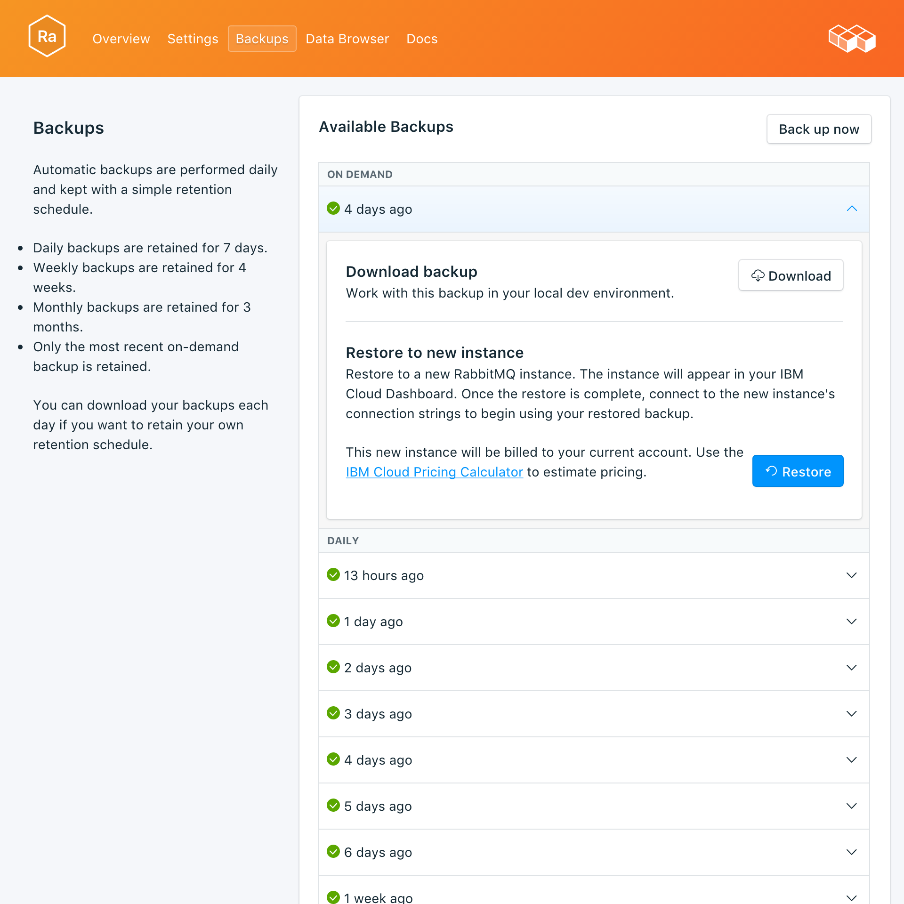

---

copyright:
  years: 2017
lastupdated: "2017-10-16"
---

{:new_window: target="_blank"}
{:shortdesc: .shortdesc}
{:screen: .screen}
{:codeblock: .codeblock}
{:pre: .pre}

# Sicherungen
{: #backups}

Sie können Sicherungen erstellen und über die Seite *Verwalten* Ihres Service-Dashboards herunterladen. Es sind sowohl geplante als auch manuelle Sicherungen verfügbar.

## Vorhandene Sicherungen anzeigen

Tägliche Sicherungen Ihrer Datenbank werden automatisch geplant. Navigieren Sie zum Anzeigen Ihrer vorhandenen Sicherungen zu der Seite *Verwalten* Ihres Service-Dashboards. 


Klicken Sie in eine Zeile, um die Optionen für die entsprechende verfügbare Sicherung zu erweitern.

 

## Sicherung bedarfsgerecht erstellen

Neben geplanten Sicherungen können Sie manuelle Sicherungen erstellen. Navigieren Sie zum Erstellen einer manuellen Sicherung zu der Seite *Verwalten* Ihres Service-Dashboards und klicken Sie auf *Jetzt sichern*.

## Sicherung herunterladen

Navigieren Sie zum Herunterladen einer Sicherung zu der Seite *Verwalten* Ihres Service-Dashboards und klicken Sie in der entsprechenden Zeile mit der Sicherung, die Sie herunterladen wollen, auf *Herunterladen*.

## Inhalt von Sicherungen

RabbitMQ-Sicherungen sind eine JSON-Darstellung der Metadaten Ihres Brokers. Sie werden mit einem Exportbefehl erstellt, der vom RabbitMQ-Verwaltungs-Plug-in bereitgestellt wird. Die Ausführung des Exportbefehls für Ihren Service beeinträchtigt die Leistung nicht.

## Sicherung mit lokaler Datenbank verwenden

Sie können mit Ihrer {{site.data.keyword.composeForRabbitMQ}}-Sicherung eine lokale Kopie Ihrer Datenbank ausführen.

Es muss eine lokale Instanz von RabbitMQ aktiv sein und die RabbitMQ-Verteilung muss das Verwaltungs-Plug-in enthalten. Aktivieren Sie es mit dem Befehl `rabbitmq-plugins enable rabbitmq_management`. Dadurch erhalten Sie außerdem Folgendes:

* die Administratorbenutzerschnittstelle unter `http://localhost:15672/`
* die HTTP-API unter `http://server-name:15672/api/`
* das Befehlszeilentool `rabbitmqadmin` der API unter `http://localhost:15672/cli/`

Sie haben beim Import der JSON-Sicherungsdatei folgende Optionen:

* Verwenden Sie in der Administratorbenutzerschnittstelle unter http://localhost:15672/ die Funktion _Import-/Exportdefinitionen_ unten auf der Seite _Übersicht_.
* Senden Sie in der API einen POST-Befehl an `http://server-name:15672/api/definitions`. Beispiel:
```http
curl -i -u guest:guest -H "content-type:application/json" -X POST --data @<path_to_your_rabbitmq_backup> http://localhost:15672/api/definitions
```
* Verwenden Sie den Befehl `rabbitmqadmin import <your_rabbitmq_backup>`.

## Sicherung wiederherstellen

Führen Sie zum Wiederherstellen einer Sicherung in eine neue Serviceinstanz die Schritte zum Anzeigen der vorhandenen Sicherungen aus. Klicken Sie dann in die entsprechende Zeile, um die Optionen für die Sicherung zu erweitern, die Sie herunterladen wollen. Klicken Sie auf die Schaltfläche **Wiederherstellen**. Es wird eine Nachricht darüber angezeigt, dass eine Wiederherstellung eingeleitet wurde. Die neue Serviceinstanz erhält automatisch den Namen "rabbitmq-restore-[timestamp]" und wird beim Start der Bereitstellung in Ihrem Dashboard angezeigt.
