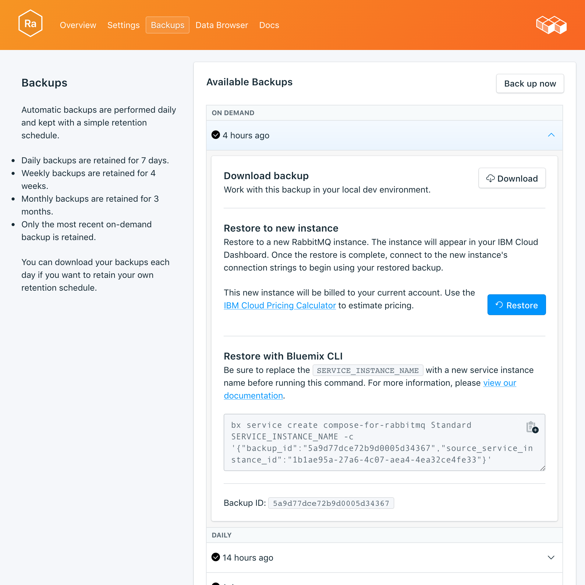

---

copyright:
  years: 2017
lastupdated: "2017-10-16"
---

{:new_window: target="_blank"}
{:shortdesc: .shortdesc}
{:screen: .screen}
{:codeblock: .codeblock}
{:pre: .pre}

# Sauvegardes
{: #backups}

Vous pouvez créer et télécharger des sauvegardes à partir de la page *Gérer* du tableau de bord de votre service. Les sauvegardes planifiées comme manuelles sont disponibles.

## Affichage des sauvegardes existantes

Des sauvegardes quotidiennes de votre base de données sont automatiquement planifiées. Pour afficher vos sauvegardes existantes, accédez à la page *Gérer* du tableau de bord de votre service. 


Cliquez sur la ligne correspondante pour développer les options de chaque sauvegarde disponible.

 

## Création d'une sauvegarde à la demande

Outre les sauvegardes planifiées, vous pouvez créer une sauvegarde manuelle. Pour créer une sauvegarde manuelle, accédez à la page *Gérer* du tableau de bord de votre service et cliquez sur *Backup now*.

## Téléchargement d'une sauvegarde

Pour télécharger une sauvegarde, accédez à la page *Gérer* du tableau de bord de votre service et cliquez sur *Télécharger* sur la ligne correspondant à la sauvegarde que vous voulez télécharger.

## Contenu de sauvegarde

Les sauvegardes RabbitMQ sont une représentation JSON des métadonnées du courtier. Elles sont créées à partir d'une commande d'exportation fournie par le plug-in de gestion de RabbitMQ. L'exécution de l'exportation sur votre service n'a aucune répercussion sur les performances.

## Utilisation d'une sauvegarde avec une base de données locale

Vous pouvez utiliser votre sauvegarde {{site.data.keyword.composeForRabbitMQ}} pour exécuter une copie locale de votre base de données. 

Vous aurez besoin d'une instance locale RabbitMQ en cours d'exécution, avec le plug-in de gestion inclus dans la distribution RabbitMQ. Activez-le avec `rabbitmq-plugins enable rabbitmq_management`. Avec cette ligne de commande vous obtenez en plus :

* l'identificateur unique de l'administrateur à l'adresse `http://localhost:15672/`,
* l'API HTTP à l'adresse `http://server-name:15672/api/`,
* et l'outil de ligne de commande de l'API `rabbitmqadmin` à l'adresse `http://localhost:15672/cli/ `.

Pour importer le fichier de sauvegarde JSON, vous pouvez :

* par le biais de l'identificateur unique de l'administrateur à http://localhost:15672/, utiliser la fonction d'_importation/exportation de définitions_ proposée au bas de la page _Vue d'ensemble_.
* par le biais de l'API, envoyer un POST à `http://server-name:15672/api/definitions`, par exemple :
```http
curl -i -u guest:guest -H "content-type:application/json" -X POST --data @<path_to_your_rabbitmq_backup> http://localhost:15672/api/definitions
```
* utiliser la commande `rabbitmqadmin import <your_rabbitmq_backup>`.

## Restauration d'une sauvegarde

Pour restaurer une sauvegarde sur une nouvelle instance de service, suivez la procédure d'affichage des sauvegardes, puis cliquez sur la ligne correspondante afin de développer les options de la sauvegarde que vous voulez télécharger. Cliquez sur le bouton **Restore**. Un message vous indiquant qu'une restauration a été initiée s'affiche. La nouvelle instance de service sera automatiquement nommée "rabbitmq-restore-[timestamp]" ; elle s'affiche dans votre tableau de bord au démarrage de la mise à disposition.
