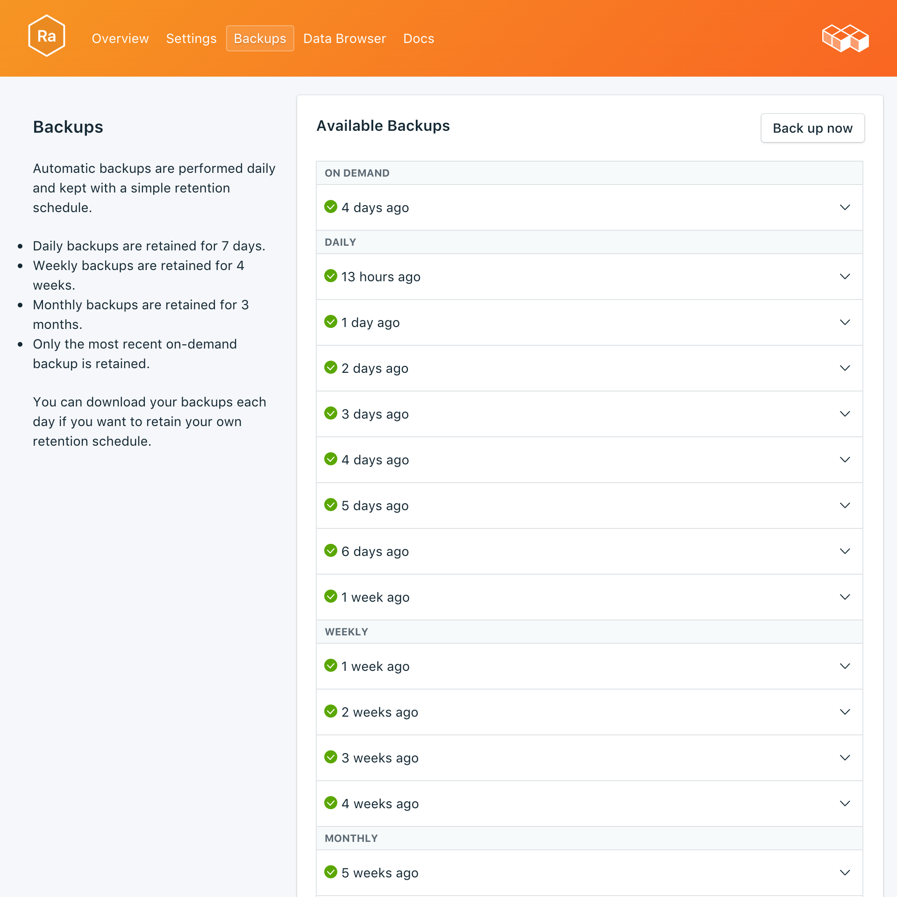
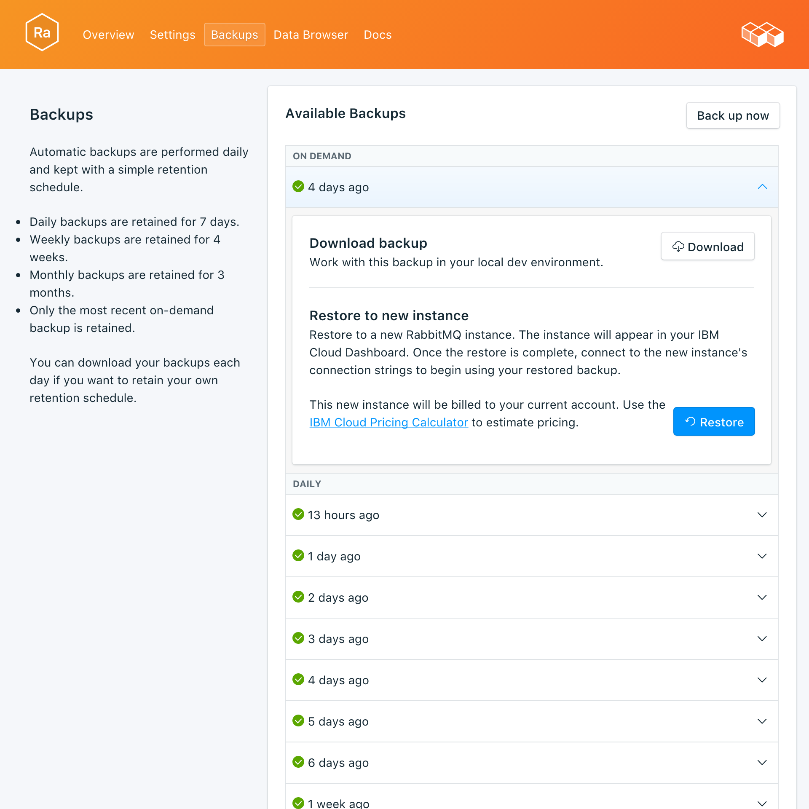

---

copyright:
  years: 2017
lastupdated: "2017-10-16"
---

{:new_window: target="_blank"}
{:shortdesc: .shortdesc}
{:screen: .screen}
{:codeblock: .codeblock}
{:pre: .pre}

# バックアップ
{: #backups}

サービス・ダッシュボードの*「管理」*ページから、バックアップを作成してダウンロードできます。スケジュールされたバックアップと手作業のバックアップの両方が利用できます。

## 既存のバックアップの表示

データベースの日次バックアップは自動的にスケジュールされます。既存のバックアップを表示するには、サービス・ダッシュボードの*「管理」*ページに移動します。 



対応する行をクリックして、選択可能バックアップのオプションを展開します。

 

## オンデマンドでのバックアップ作成

スケジュールされたバックアップだけでなく、バックアップを手作業で作成することができます。手動でバックアップを作成する場合は、サービス・ダッシュボードの*「管理」*ページに移動して、*「今すぐバックアップ」*をクリックします。

## バックアップのダウンロード

バックアップをダウンロードするには、サービス・ダッシュボードの*「管理」*ページに移動し、ダウンロードするバックアップに対応する行で*「ダウンロード」*をクリックします。

## バックアップの内容

RabbitMQ バックアップは、ブローカーのメタデータの JSON 表現です。RabbitMQ 管理プラグインに用意されているエクスポート・コマンドで作成できます。サービスでエクスポートを実行しても、パフォーマンスへの影響はありません。

## ローカル・データベースのバックアップの使用

{{site.data.keyword.composeForRabbitMQ}} のバックアップ機能を使用して、データベースのローカル・コピーを実行できます。

RabbitMQ ディストリビューションに組み込まれている管理プラグインによって、RabbitMQ のローカル・インスタンスを実行しておく必要があります。`rabbitmq-plugins enable rabbitmq_management` で有効にしてください。そうすると、さらに以下の機能も追加されます。

* 管理 UI (`http://localhost:15672/`)
* HTTP API (`http://server-name:15672/api/`)
* API のコマンド・ライン・ツール `rabbitmqadmin` (`http://localhost:15672/cli/`)

JSON バックアップ・ファイルをインポートするには、以下のようにします。

* 管理 UI (http://localhost:15672/) の場合は、_「概要」_ページの下部にある_「定義のインポート/エクスポート」_機能を使用します。
* API の場合は、POST を `http://server-name:15672/api/definitions` に送信します。以下に例を示します。
```http
curl -i -u guest:guest -H "content-type:application/json" -X POST --data @<path_to_your_rabbitmq_backup> http://localhost:15672/api/definitions
```
* `rabbitmqadmin import <your_rabbitmq_backup>` コマンドを使用します。

## バックアップのリストア

新しいサービス・インスタンスにバックアップをリストアするには、既存のバックアップを表示する手順を実行してから、対応する行をクリックして、ダウンロードするバックアップのオプションを展開表示します。**「リストア (Restore)」**ボタンをクリックします。復元が開始されたことを示すメッセージが表示されます。新しいサービス・インスタンスに rabbitmq-restore-[timestamp] という名前が自動的に設定され、プロビジョニングが開始されるとその名前がダッシュボードに表示されます。
