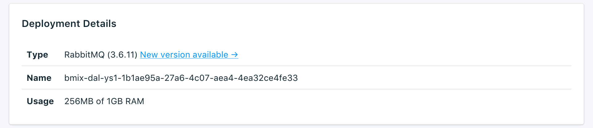

---

Copyright:
  Years: 2017
lastupdated: "2017-09-06"
---

{:new_window: target="_blank"}
{:shortdesc: .shortdesc}
{:screen: .screen}
{:codeblock: .codeblock}
{:pre: .pre}

# サービス概要

{{site.data.keyword.cloud}} Compose データベースに関する情報は_「概要」_ページに表示されます。概要には、必要不可欠な識別情報と現在のリソース使用率が含まれます。ツールで使用する接続ストリングのセクションもあります。接続ストリングを使用してツールからデータベースに接続することもできます。

## デプロイメントの詳細

_「デプロイメントの詳細 (Deployment Details)」_パネルには、サービスの詳細が表示されます。

### タイプ

サービスによって提供されるデータベースのタイプ、およびサービスが使用するデータベースのバージョン。

### 名前

サービスの内部 ID。

### 使用法

データベース・サイズとご使用のサービス・プランで利用可能なストレージ容量。

## 接続ストリング

_「接続ストリング」_パネルの各タブで、サービスで使用できるそれぞれの接続ストリングを確認できます。

### HTTPS

**HTTPS** 接続ストリングは、いくつかのクライアント・ライブラリーで使用でき、他のライブラリーが接続するために必要なすべての情報を含んでいます。接続ストリングを使用して接続する方法については、[外部アプリケーションの接続](./connecting-external.html)を参照してください。

Compose RabbitMQ のデプロイメントでは、サーバー上の自己署名証明書でバックアップされた TLS セキュア接続 (`amqps://`) だけを使用できます。

### 管理

**「管理」**タブにあるリンクから、_「RabbitMQ 管理」_ページを表示できます。**HTTPS** 接続ストリングの amqps:// と @ の間の部分がログイン情報になります。

### SSL 証明書

Compose {{site.data.keyword.cloud_notm}} サービスでは、データベース接続で使用できる SSL 証明書を提供しています。

