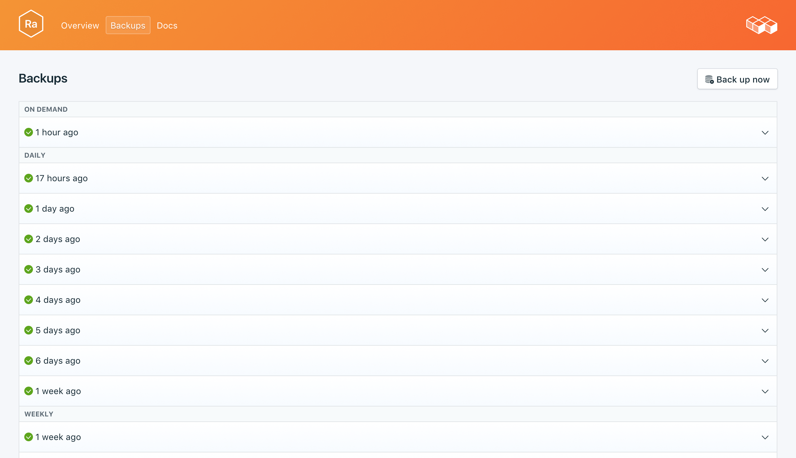
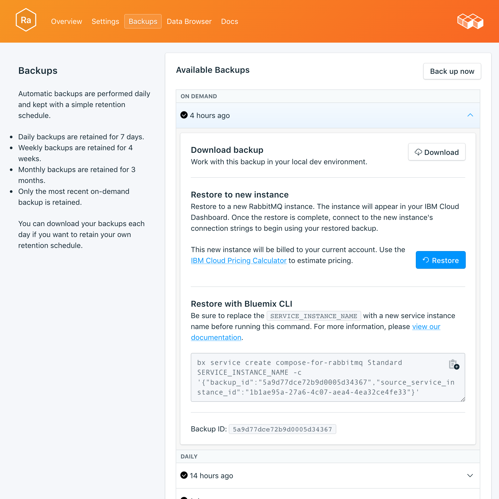

---

copyright:
  years: 2017
lastupdated: "2017-10-16"
---

{:new_window: target="_blank"}
{:shortdesc: .shortdesc}
{:screen: .screen}
{:codeblock: .codeblock}
{:pre: .pre}

# 백업
{: #backups}

서비스 대시보드의 *관리* 페이지에서 백업을 작성하고 다운로드할 수 있습니다. 스케줄된 백업과 수동 백업이 모두 사용 가능합니다.

## 기존 백업 보기

데이터베이스의 일간 백업이 자동으로 스케줄됩니다. 기존 백업을 보려면 서비스 대시보드의 *관리* 페이지로 이동하십시오. 



해당 행을 클릭하여 사용 가능한 백업에 대한 옵션을 펼치십시오.

 

## 요청 시 백업 작성

스케줄된 백업은 물론 수동으로 백업을 작성할 수도 있습니다. 수동 백업을 작성하려면 서비스 대시보드의 *관리* 페이지로 이동하여 *지금 백업*을 클릭하십시오.

## 백업 다운로드

백업을 다운로드하려면 서비스 대시보드의 *관리* 페이지로 이동하여 다운로드할 백업에 해당하는 행에서 *다운로드*를 클릭하십시오. 

## 백업 컨텐츠

RabbitMQ 백업은 브로커 메타데이터의 JSON 표시이며 RabbitMQ 관리 플러그인에서 제공되는 내보내기 명령에서 작성됩니다. 서비스에 대해 내보내기를 실행해도 성능에 영향이 미치지 않습니다. 

## 로컬 데이터베이스에 백업 사용

{{site.data.keyword.composeForRabbitMQ}} 백업을 사용하여 데이터베이스의 로컬 사본을 실행할 수 있습니다.

RabbitMQ 배포에 포함된 관리 플러그인과 함께 RabbitMQ의 로컬 인스턴스가 실행 중이어야 합니다. `rabbitmq-plugins enable rabbitmq_management`를 통해 이를 사용으로 설정하십시오. 이는 추가적으로 다음을 가져옵니다.

* 관리 UI(`http://localhost:15672/`)
* HTTP API(`http://server-name:15672/api/`)
* API의 명령행 도구 `rabbitmqadmin`(`http://localhost:15672/cli/ `)

다음과 같이 JSON 백업 파일을 가져올 수 있습니다.

* 관리 UI(http://localhost:15672/)를 통해 _개요_ 페이지의 맨 아래에 있는 _정의 가져오기/내보내기_ 기능을 사용합니다
* API를 통해 `http://server-name:15672/api/definitions`에 POST를 전송합니다. 예:
```http
curl -i -u guest:guest -H "content-type:application/json" -X POST --data @<path_to_your_rabbitmq_backup> http://localhost:15672/api/definitions
```
* 다음 명령을 사용합니다. `rabbitmqadmin import <your_rabbitmq_backup>`.

## 백업 복원

백업을 새 서비스 인스턴스에 복원하려면 단계에 따라 기존 백업을 확인한 후 해당 행을 클릭하여 다운로드할 백업에 대한 옵션을 펼치십시오. **복원** 단추를 클릭하십시오. 복원이 시작되었음을 알리는 메시지가 표시됩니다. 새 서비스 인스턴스가 자동으로 "rabbitmq-restore-[timestamp]"로 이름 지정되고 프로비저닝이 시작될 때 대시보드에 표시됩니다.
