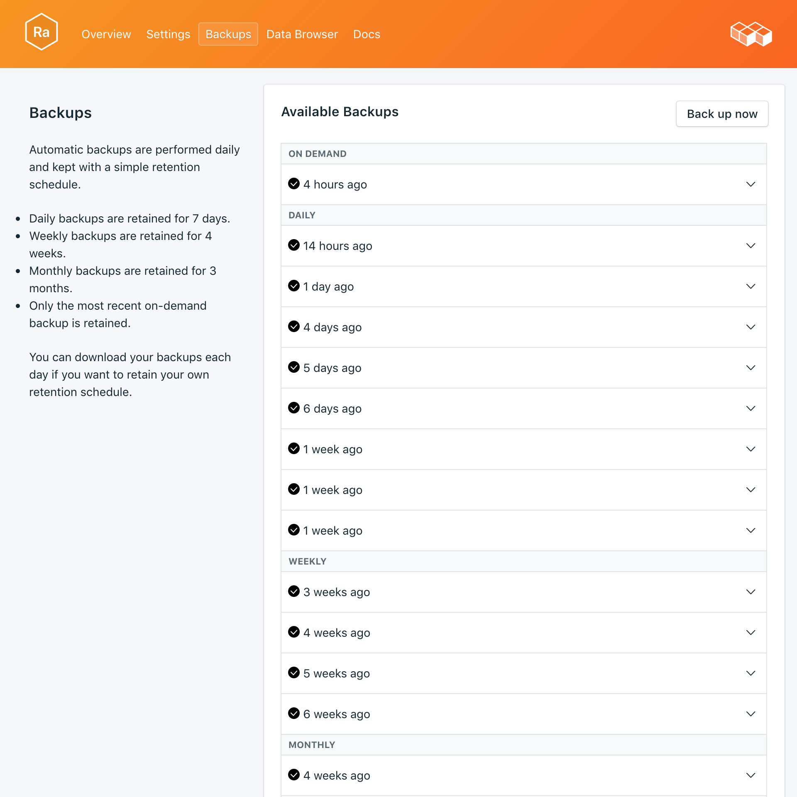

---

Copyright:
  Years: 2017
lastupdated: "2017-10-16"
---

{:new_window: target="_blank"}
{:shortdesc: .shortdesc}
{:screen: .screen}
{:codeblock: .codeblock}
{:pre: .pre}

# Backups
{: #backups}

É possível criar e fazer download de backups na página *Gerenciar* de seu painel de serviço. Ambos os backups, planejado e manual, estão disponíveis.

## Visualizando backups existentes

Os backups diários de seu banco de dados são planejados automaticamente. Para visualizar seus backups existentes, navegue para a página *Gerenciar* de seu painel de serviço. 



Clique na linha correspondente para expandir as opções para qualquer backup disponível.

 

## Criando um backup sob demanda

Além de backups planejados, é possível criar um backup manualmente. Para criar um backup manual, navegue para a página *Gerenciar* de seu painel de serviço e clique em *Fazer backup agora*.

## Fazendo download de um backup

Para fazer download de um backup, navegue para a página *Gerenciar* de seu painel de serviço e clique em *Fazer download* na linha correspondente para o backup que você deseja fazer download.

## Conteúdos de backup

Os backups do RabbitMQ são uma representação JSON de metadados do seu broker. Eles são criados por meio de um comando de exportação fornecida pelo plug-in de gerenciamento do RabbitMQ. Executar a exportação em seu serviço não afeta o desempenho.

## Usando um backup com um banco de dados local

É possível usar o backup do {{site.data.keyword.composeForRabbitMQ}} para executar uma cópia local de seu banco de dados.

Você precisará ter uma instância local do RabbitMQ em execução, com o plug-in de gerenciamento incluído na distribuição do RabbitMQ. Ative-o com `rabbitmq-plugins enable rabbitmq_management`. Com isso, você também obterá a:

* a UI de administrador em `http://localhost:15672/`,
* a API de HTTP em `http://server-name:15672/api/`
* e a ferramenta de linha de comandos da API `rabbitmqadmin` em `http://localhost:15672/cli/ `.

Para importar o arquivo de backup JSON, é possível:

* por meio da UI de administrador em http://localhost:15672/, usar a função _Importar/Exportar definições_ na parte inferior da página _Visão geral_.
* por meio da API, enviar um POST para o exemplo `http://server-name:15672/api/definitions`:
```http
curl -i -u guest:guest -H "content-type:application/json" -X POST --data @<path_to_your_rabbitmq_backup> http://localhost:15672/api/definitions
```
* usar o comando `rabbitmqadmin import <your_rabbitmq_backup>`.

## Restaurando um backup

Para restaurar um backup para uma nova instância de serviço, siga as etapas para visualizar os backups existentes, em seguida, clique na linha correspondente para expandir as opções para o backup que você deseja fazer download. Clique no botão **Restaurar**. Uma mensagem é exibida para permitir que você saiba que uma restauração foi iniciada. A nova instância de serviço será nomeada automaticamente "rabbitmq-restore-[timestamp]" e aparecerá em seu painel quando o fornecimento iniciar.
