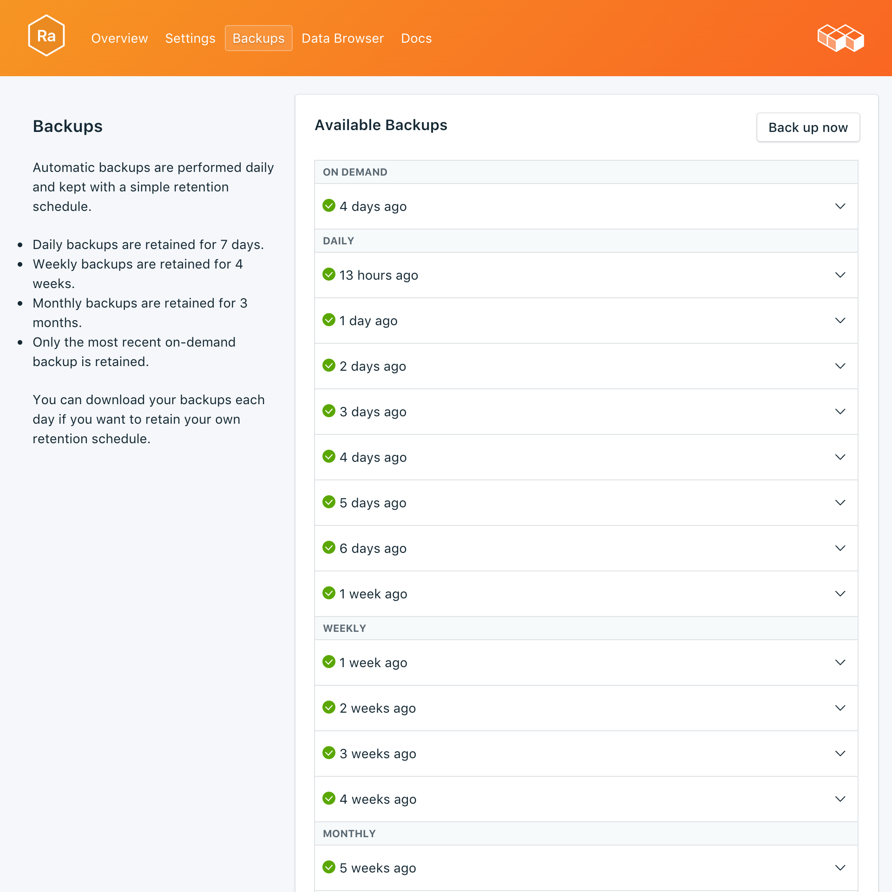
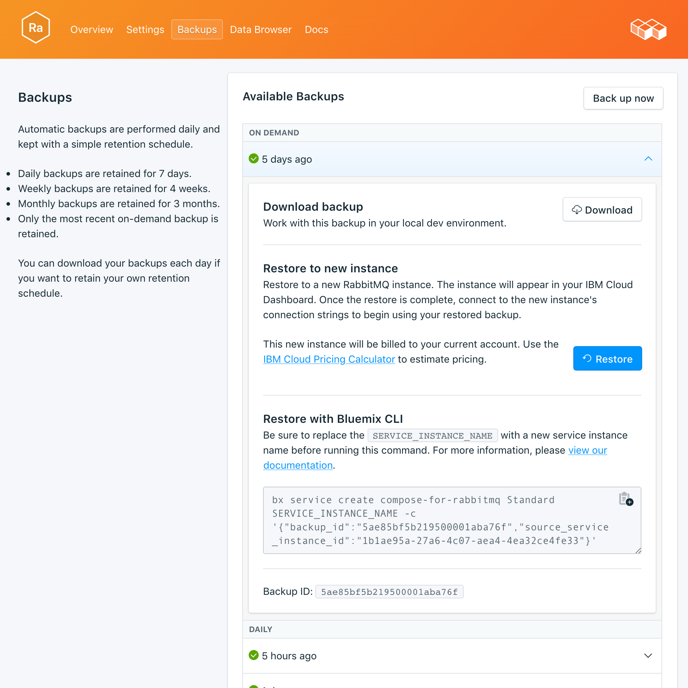

---

copyright:
  years: 2017
lastupdated: "2017-10-16"
---

{:new_window: target="_blank"}
{:shortdesc: .shortdesc}
{:screen: .screen}
{:codeblock: .codeblock}
{:pre: .pre}

# 备份
{: #backups}

您可以从服务仪表板的*管理*页面创建和下载备份。可以使用安排的备份和手动备份。

## 查看现有备份

数据库的每日备份会自动安排。要查看现有备份，请浏览至服务仪表板的*管理*页面。 



单击相应的行以展开任何可用备份的选项。

 

## 随需应变创建备份

除了已安排的备份，您还可以手动创建备份。要创建手动备份，请浏览至服务仪表板的*管理*页面，然后单击*立即备份*。

## 下载备份

要下载备份，请浏览至服务仪表板的*管理*页面，然后单击要下载的备份相应行中的*下载*。

## 备份内容

RabbitMQ 备份是代理程序元数据的 JSON 表示。它们是通过 RabbitMQ 管理插件提供的导出命令创建的。对您的服务运行导出不会影响性能。

## 将备份与本地数据库配合使用

您可以使用 {{site.data.keyword.composeForRabbitMQ}} 备份来运行数据库的本地副本。

您需要运行 RabbitMQ 的本地实例，并且管理插件要包含在 RabbitMQ 分发中。使用 `rabbitmq-plugins enable rabbitmq_management` 对其加以启用。这还可以让您获取：

* 管理 UI，网址为 `http://localhost:15672/`
* HTTP API，网址为 `http://server-name:15672/api/`
* API 的命令行工具 `rabbitmqadmin`，网址为 `http://localhost:15672/cli/`。

要导入 JSON 备份文件，您可以：

* 通过位于 http://localhost:15672/ 的管理 UI，使用_概述_页面底部的_导入/导出定义_功能。
* 通过 API，将 POST 发送到 `http://server-name:15672/api/definitions` 示例：
```http
curl -i -u guest:guest -H "content-type:application/json" -X POST --data @<path_to_your_rabbitmq_backup> http://localhost:15672/api/definitions
```
* 使用命令 `rabbitmqadmin import <your_rabbitmq_backup>`。

## 复原备份

要将备份复原到新服务实例，请执行以下步骤以查看现有备份，然后单击相应的行以展开要下载的备份的选项。单击**复原**按钮。此时将显示一条消息，通知您已启动复原。新服务实例将自动命名为“rabbitmq-restore-[timestamp]”，并在供应启动时显示在仪表板上。
