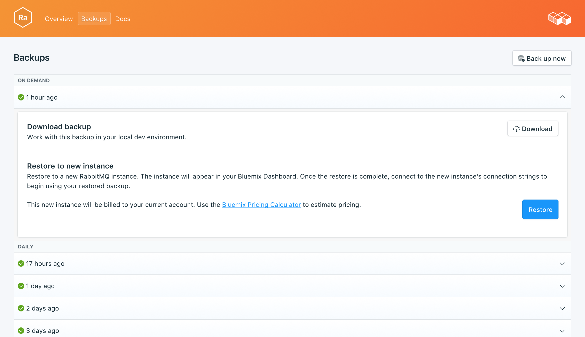

---

copyright:
  years: 2017,2018
lastupdated: "2017-10-16"
---

{:new_window: target="_blank"}
{:shortdesc: .shortdesc}
{:screen: .screen}
{:codeblock: .codeblock}
{:pre: .pre}

# 備份
{: #backups}

您可以從服務儀表板的_管理_ 頁面的_備份_ 標籤中，建立及下載備份。有每日、每週、每月及隨需應變備份可供使用。系統會根據下列排程保留它們：

備份類型|保留排程
----------|-----------
每日|每日備份保留 7 日
每週|每週備份保留 4 週
每月|每月備份保留 3 個月
隨需應變|保留一個隨需應變備份。保留的備份一律是最新的隨需應變備份。
{: caption="表 1. 備份保留排程" caption-side="top"}

備份排程與保留原則是固定的。如果您需要保留的備份數目超過保留排程所容許的數目，則應該根據您的商業需求下載備份及保留保存檔。

## 檢視現有備份

資料庫的每日備份是自動排定的。若要檢視現有備份，請導覽至服務儀表板的*管理* 頁面。 


按一下對應列來展開任何可用備份的選項。

 

## 依需求建立備份

除了排程備份外，您也可以手動建立備份。若要建立手動備份，請導覽至服務儀表板的*管理* 頁面，然後按一下*立即備份*。

## 下載備份

若要下載備份，請導覽至服務儀表板的*管理* 頁面，然後針對您要下載的備份，按一下對應列中的*下載*。

## 備份內容

RabbitMQ 備份是分配管理系統 meta 資料的 JSON 表示法。它們是透過 RabbitMQ 管理外掛程式所提供的匯出指令建立的。對服務執行匯出不會影響效能。

## 使用備份與本端資料庫搭配

您可以使用 {{site.data.keyword.composeForRabbitMQ}} 備份來執行資料庫的本端副本。

您將需要執行 RabbitMQ 的本端實例，此實例的管理外掛程式包括在 RabbitMQ 發行套件中。請使用 `rabbitmq-plugins enable rabbitmq_management` 來啟用它。另外，您將取得：

* `http://localhost:15672/` 上的管理使用者介面、
* `http://server-name:15672/api/` 上的 HTTP API，
* 以及 `http://localhost:15672/cli/ ` 上的 API 指令行工具 `rabbitmqadmin`。

若要匯入 JSON 備份檔，您可以執行下列動作：

* 透過 http://localhost:15672/ 上的管理使用者介面，使用_概觀_ 頁面底端的_匯入/匯出定義_ 功能。
* 透過 API，將 POST 傳送至 `http://server-name:15672/api/definitions` 範例：
```http
curl -i -u guest:guest -H "content-type:application/json" -X POST --data @<path_to_your_rabbitmq_backup> http://localhost:15672/api/definitions
```
* 使用 `rabbitmqadmin import <your_rabbitmq_backup>` 指令。

## 還原備份

若要將備份還原至新的服務實例，請遵循步驟來檢視現有備份，然後按一下對應列以展開您要下載之備份的選項。按一下**還原**按鈕。即會顯示一則訊息，讓您知道已起始還原。新的服務實例會自動命名為 "rabbitmq-restore-[timestamp]"，而且在佈建開始時，儀表板上會出現這個實例。
